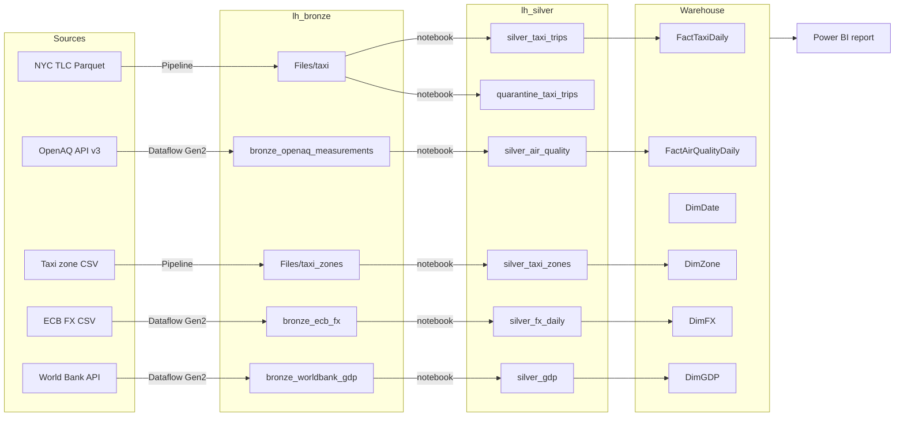

# Lineage

Planned flow. Table names come from `config/sources.json`; updated as items are built.

```mermaid
flowchart LR
  subgraph Sources
    TLC[NYC TLC Parquet]
    ZONES[Taxi zone CSV]
    OAQ[OpenAQ API v3]
    WB[World Bank API]
    ECB[ECB FX CSV]
  end

  subgraph Bronze[lh_bronze]
    B_TAXI[Files/taxi]
    B_ZONES[Files/taxi_zones]
    B_OAQ[bronze_openaq_measurements]
    B_WB[bronze_worldbank_gdp]
    B_ECB[bronze_ecb_fx]
  end

  subgraph Silver[lh_silver]
    S_TAXI[silver_taxi_trips]
    Q_TAXI[quarantine_taxi_trips]
    S_ZONES[silver_taxi_zones]
    S_AQ[silver_air_quality]
    S_GDP[silver_gdp]
    S_FX[silver_fx_daily]
  end

  subgraph Gold[Warehouse]
    F_TAXI[FactTaxiDaily]
    F_AQ[FactAirQualityDaily]
    D_DATE[DimDate]
    D_ZONE[DimZone]
    D_FX[DimFX]
    D_GDP[DimGDP]
  end

  TLC -- Pipeline --> B_TAXI
  ZONES -- Pipeline --> B_ZONES
  OAQ -- Dataflow Gen2 --> B_OAQ
  WB -- Dataflow Gen2 --> B_WB
  ECB -- Dataflow Gen2 --> B_ECB

  B_TAXI -- notebook --> S_TAXI & Q_TAXI
  B_ZONES -- notebook --> S_ZONES
  B_OAQ -- notebook --> S_AQ
  B_WB -- notebook --> S_GDP
  B_ECB -- notebook --> S_FX

  S_TAXI --> F_TAXI
  S_ZONES --> D_ZONE
  S_AQ --> F_AQ
  S_FX --> D_FX
  S_GDP --> D_GDP

  Gold --> PBI[Power BI report]
```
